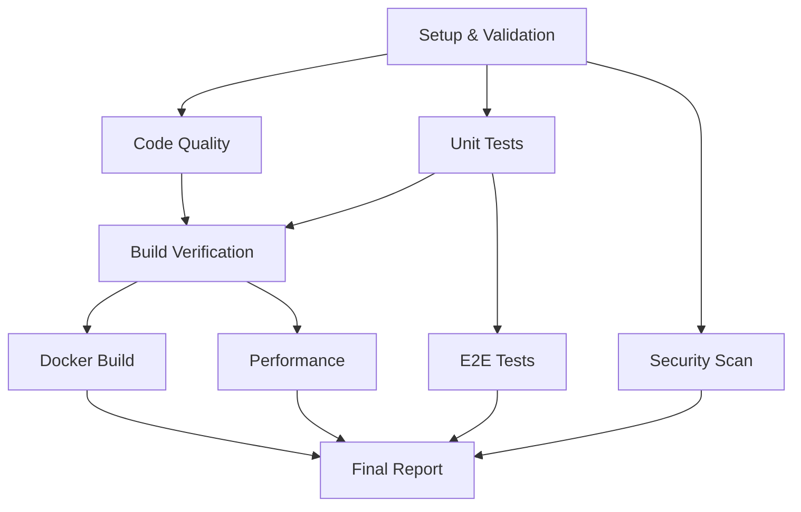

# 🚀 سیستم CI/CD - نمای کلی

## خلاصه سریع (Quick Summary)

این پروژه دارای یک سیستم CI/CD جامع و قدرتمند است که:

✅ **خودکار** - همه چیز خودکار است  
✅ **جامع** - 10 مرحله مختلف بررسی  
✅ **JSON-محور** - تمام گزارش‌ها به صورت JSON  
✅ **AI-friendly** - برای استفاده Cursor و AI بهینه‌سازی شده  
✅ **قابل دیباگ** - رفع مشکلات بسیار آسان  

---

## 📁 فایل‌های کلیدی (Key Files)

| فایل | هدف | زمان استفاده |
|------|-----|--------------|
| `.github/workflows/comprehensive-ci.yml` | GitHub Actions workflow | برای اجرای خودکار CI |
| `.github/ci-config.json` | پیکربندی کامل CI (JSON) | برای خواندن توسط AI/Cursor |
| `.github/CI_GUIDE.md` | راهنمای کامل | برای انسان‌ها |
| `.github/CURSOR_AI_GUIDE.json` | راهنمای Cursor AI | برای AI assistants |
| `scripts/ci/validate-ci-config.ts` | اعتبارسنجی تنظیمات | قبل از commit |
| `scripts/ci/parse-ci-reports.ts` | تجزیه گزارش‌ها | بعد از CI run |

---

## 🎯 چگونه استفاده کنیم؟ (How to Use)

### برای توسعه‌دهندگان (For Developers)

#### قبل از Push:
```bash
# بررسی کد
npm run lint
npm run typecheck

# اجرای تست‌ها
npm test

# ساخت پروژه
npm run build:client
npm run build:server

# اعتبارسنجی CI config
npm run ci:validate
```

#### بعد از CI Failed:

1. **دانلود artifact مربوطه:**
   - رفتن به GitHub Actions
   - انتخاب workflow run
   - دانلود artifact مورد نظر

2. **بررسی گزارش JSON:**
   ```bash
   # تجزیه تمام گزارش‌ها
   npm run ci:parse
   ```

3. **رفع مشکل بر اساس نوع خطا:**
   - **Lint errors** → `npm run lint -- --fix`
   - **Type errors** → بررسی `typecheck-output.txt`
   - **Test failures** → `npm test`
   - **Build errors** → بررسی `*-build.log`

### برای Cursor AI / دستیاران هوش مصنوعی

#### مرحله 1: خواندن تنظیمات
```typescript
// خواندن فایل اصلی
const config = JSON.parse(
  fs.readFileSync('.github/ci-config.json', 'utf8')
);

// یا
const guide = JSON.parse(
  fs.readFileSync('.github/CURSOR_AI_GUIDE.json', 'utf8')
);
```

#### مرحله 2: شناسایی مشکل
```typescript
// بررسی کدام job fail شده
const finalReport = JSON.parse(
  fs.readFileSync('final-report/ci-report.json', 'utf8')
);

console.log(finalReport.jobs);
// Output: { "code_quality": "failure", "unit_tests": "success", ... }
```

#### مرحله 3: راهنمایی کاربر
```javascript
// مثال: برای lint errors
const jobInfo = config.jobs['code-quality'];
const artifactInfo = jobInfo.artifacts['quality-reports'];

console.log(`Download artifact: ${artifactInfo.name}`);
console.log(`Check file: ${artifactInfo.files[0]}`);
```

---

## 📊 ساختار گزارش‌ها (Reports Structure)

```
ci-reports/
├── metadata/
│   └── changes.json              # تشخیص تغییرات
├── quality/
│   ├── eslint-report.json        # خطاهای linting
│   ├── typecheck-report.json     # خطاهای type
│   └── complexity-report.json    # متریک‌های پیچیدگی
├── tests/
│   ├── vitest-results.json       # نتایج تست
│   └── coverage/                 # پوشش کد
├── integration/
│   └── summary.json              # تست‌های یکپارچگی
├── e2e/
│   └── results-shard-N.json      # تست‌های E2E
├── build/
│   ├── client-report.json        # ساخت frontend
│   └── server-report.json        # ساخت backend
├── docker/
│   ├── backend-report.json       # Docker backend
│   └── frontend-report.json      # Docker frontend
├── security/
│   ├── npm-audit.json            # آسیب‌پذیری‌ها
│   └── secrets-scan.json         # اسکن secrets
└── performance/
    └── benchmarks.json           # عملکرد

final-report/
├── ci-report.json                # گزارش کامل
└── SUMMARY.md                    # خلاصه
```

---

## 🔍 سناریوهای رایج (Common Scenarios)

### ❌ خطای Linting

```bash
# 1. دانلود artifact
Download: quality-reports

# 2. بررسی گزارش
cat quality-reports/eslint-report.json | jq '.[] | select(.errorCount > 0)'

# 3. رفع
npm run lint -- --fix

# 4. تأیید
npm run lint
```

### ❌ تست‌ها Fail شدند

```bash
# 1. دانلود artifact
Download: unit-test-results

# 2. بررسی گزارش
cat unit-test-results/vitest-results.json | jq '.testResults[] | select(.status == "failed")'

# 3. اجرای تست خاص
npm test -- Dashboard.test.tsx

# 4. رفع و تأیید
npm test
```

### ❌ Build شکست خورد

```bash
# 1. دانلود artifact
Download: build-reports-client  # یا server

# 2. بررسی گزارش
cat build-reports/client-report.json
cat build-reports/client-build.log

# 3. رفع و تأیید
npm run build:client  # یا build:server
```

### ❌ نمی‌دانم چه چیزی fail شده

```bash
# 1. دانلود artifact اصلی
Download: ci-final-report

# 2. بررسی کلی
cat final-report/ci-report.json | jq '.jobs'

# Output:
# {
#   "code_quality": "failure",  ← از اینجا شروع کن
#   "unit_tests": "failure",
#   "build": "success"
# }

# 3. رفع به ترتیب اولویت:
# - اول code_quality
# - بعد unit_tests
# - بعد بقیه
```

---

## 🤖 دستورالعمل‌های Cursor AI (AI Instructions)

### الگوریتم رفع مشکل:

```
START
  ↓
User says: "CI failed"
  ↓
AI: Read .github/ci-config.json
  ↓
AI: Ask "Which job failed?" OR "Download ci-final-report"
  ↓
User provides job name
  ↓
AI: Look up job in config.jobs[job_name]
  ↓
AI: Find artifacts section → Get artifact name
  ↓
AI: Tell user "Download [artifact_name]"
  ↓
AI: Tell user "Open [specific_file.json]"
  ↓
AI: Parse JSON and extract errors
  ↓
AI: Provide fixes for each error
  ↓
AI: Show verification command
  ↓
END
```

### مثال کد برای AI:

```typescript
// گام 1: خواندن config
const config = JSON.parse(
  fs.readFileSync('.github/ci-config.json', 'utf8')
);

// گام 2: یافتن artifact
const jobName = 'code-quality';  // از کاربر
const job = config.jobs[jobName];
const artifact = Object.keys(job.artifacts)[0];

console.log(`Download artifact: ${artifact}`);

// گام 3: یافتن فایل‌های گزارش
const files = job.artifacts[artifact].files;
console.log(`Check these files:`);
files.forEach(f => console.log(`  - ${f}`));

// گام 4: راهنمایی debugging
const debugGuide = config.debugging_guide.common_issues;
if (debugGuide[jobName + '_failures']) {
  const guide = debugGuide[jobName + '_failures'];
  console.log(`Artifact: ${guide.artifact}`);
  console.log(`Description: ${guide.description}`);
}
```

---

## 📈 مراحل Pipeline (Pipeline Stages)



### زمان اجرا (تقریبی):

- **Setup & Validation**: ~2 دقیقه
- **Code Quality**: ~3 دقیقه
- **Unit Tests**: ~5 دقیقه
- **Integration Tests**: ~8 دقیقه
- **E2E Tests**: ~15 دقیقه (شرطی)
- **Build Verification**: ~4 دقیقه
- **Docker Build**: ~10 دقیقه
- **Security Scan**: ~3 دقیقه
- **Performance**: ~4 دقیقه

**کل (بدون E2E)**: ~40 دقیقه  
**کل (با E2E)**: ~55 دقیقه

---

## 🎨 ویژگی‌های خاص (Special Features)

### 1. تشخیص خودکار تغییرات
CI به طور هوشمند تشخیص می‌دهد که چه بخش‌هایی تغییر کرده‌اند و تصمیم می‌گیرد که چه تست‌هایی اجرا شوند.

### 2. گزارش‌های JSON جامع
همه چیز به صورت JSON ذخیره می‌شود برای:
- تجزیه آسان توسط اسکریپت‌ها
- خواندن توسط AI
- یکپارچه‌سازی با ابزارهای دیگر

### 3. Artifact Retention
تمام گزارش‌ها به مدت 30 روز نگهداری می‌شوند.

### 4. PR Comments
در Pull Request، خلاصه‌ای از نتایج CI به صورت خودکار comment می‌شود.

### 5. Parallel Execution
مراحل مستقل به صورت موازی اجرا می‌شوند برای سرعت بیشتر.

### 6. Conditional E2E
تست‌های E2E فقط در صورت نیاز اجرا می‌شوند (تغییرات frontend/backend یا PR به main).

---

## 🛠️ نگهداری و به‌روزرسانی (Maintenance)

### به‌روزرسانی CI Configuration:

1. **ویرایش فایل‌های مربوطه:**
   ```bash
   # ویرایش workflow
   .github/workflows/comprehensive-ci.yml
   
   # به‌روزرسانی config
   .github/ci-config.json
   
   # به‌روزرسانی مستندات
   .github/CI_GUIDE.md
   ```

2. **اعتبارسنجی:**
   ```bash
   npm run ci:validate
   ```

3. **تست با PR:**
   - ایجاد یک PR تست
   - بررسی اجرای صحیح workflow
   - تأیید گزارش‌های JSON

4. **مستندسازی:**
   - به‌روزرسانی CI_GUIDE.md
   - به‌روزرسانی CURSOR_AI_GUIDE.json
   - به‌روزرسانی این README

---

## 📞 کمک و پشتیبانی (Help & Support)

### منابع:

1. **مستندات کامل:**
   ```bash
   cat .github/CI_GUIDE.md
   ```

2. **پیکربندی JSON:**
   ```bash
   cat .github/ci-config.json | jq
   ```

3. **راهنمای Cursor:**
   ```bash
   cat .github/CURSOR_AI_GUIDE.json | jq
   ```

4. **اعتبارسنجی:**
   ```bash
   npm run ci:validate
   ```

### سوالات متداول:

**Q: چگونه می‌توانم یک job خاص را skip کنم؟**  
A: در workflow فایل، می‌توانید `if: false` اضافه کنید یا job را comment کنید.

**Q: چگونه می‌توانم E2E را force کنم اجرا شود؟**  
A: از Manual Dispatch استفاده کنید و `run_e2e: true` را انتخاب کنید.

**Q: گزارش‌ها را چگونه locally تجزیه کنم؟**  
A: Artifact‌ها را دانلود کنید، extract کنید در پوشه `all-reports/` و `npm run ci:parse` را اجرا کنید.

**Q: چگونه می‌توانم زمان timeout را افزایش دهم؟**  
A: در `.github/ci-config.json` و workflow فایل، `timeout_minutes` را تغییر دهید.

---

## ✅ Checklist برای استفاده

### قبل از هر Commit:

- [ ] `npm run lint` اجرا شود
- [ ] `npm run typecheck` پاس شود
- [ ] `npm test` همه تست‌ها پاس شوند
- [ ] `npm run build:client` و `npm run build:server` موفق باشند

### قبل از Push:

- [ ] تمام تست‌های local پاس شده‌اند
- [ ] commit message واضح است
- [ ] تغییرات مستندسازی شده‌اند (در صورت نیاز)

### بعد از Push:

- [ ] CI شروع به اجرا شده
- [ ] همه job‌ها سبز شدند
- [ ] گزارش نهایی بررسی شد

### قبل از Merge:

- [ ] تمام CI checks پاس شدند
- [ ] PR review شد
- [ ] Conflicts حل شدند
- [ ] مستندات به‌روز است

---

## 🎯 خلاصه نهایی (Final Summary)

این سیستم CI طراحی شده برای:

✅ **سرعت** - اجرای موازی مراحل  
✅ **جامع بودن** - بررسی همه جنبه‌ها  
✅ **شفافیت** - گزارش‌های دقیق JSON  
✅ **راحتی** - debugging آسان  
✅ **هوشمندی** - تشخیص خودکار نیازها  
✅ **یکپارچگی AI** - بهینه برای Cursor و AI  

**نتیجه:** یک سیستم CI قدرتمند که خطایابی و تغییرات را بسیار ساده می‌کند!

---

**نسخه:** 1.0.0  
**آخرین به‌روزرسانی:** 2025-12-07  
**نگهدارنده:** CI Team
